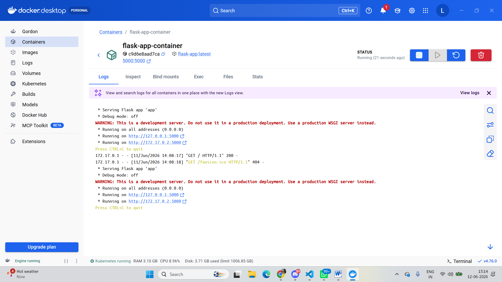
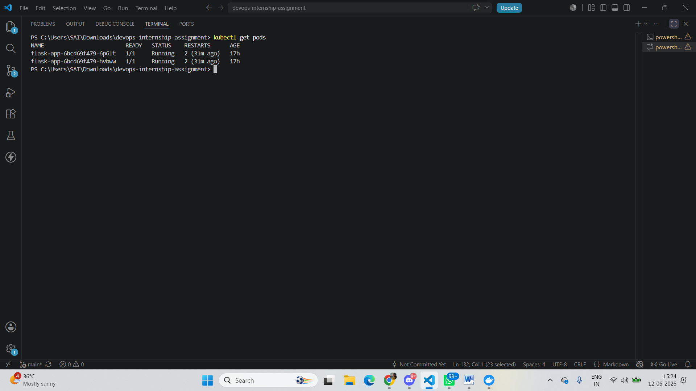
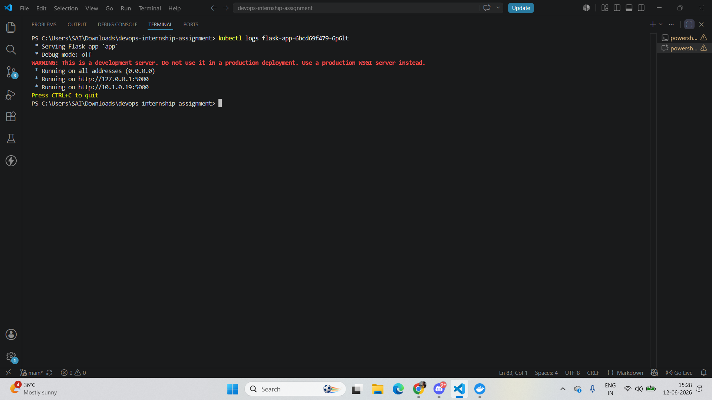
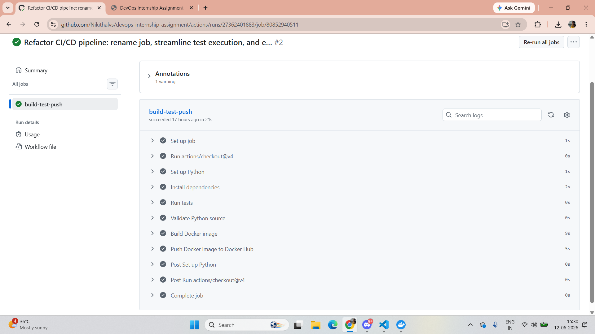

# Part 1: Version Control (Git & SSH)

## git pull vs git fetch

Both commands are used to retrieve updates from a remote repository, but they behave differently:

| **Command** | **Behaviour** |
| --- | --- |
| `git fetch` | Downloads commits, files, and refs from the remote repository into the local repo's remote-tracking branches (e.g. `origin/main`), but does **NOT** merge them into the current working branch. It lets you review changes before integrating them. |
| `git pull` | Performs a `git fetch` followed automatically by a `git merge` (or rebase, depending on configuration) of the remote-tracking branch into the current local branch. It directly updates your working files. |

> In short: **fetch** = download + review; **pull** = download + merge automatically.

---

## Resolving a Git Merge Conflict

A merge conflict occurs when two branches change the same lines of a file in different ways, and Git cannot automatically decide which version to keep. The following scenario was used to simulate and resolve a conflict:

- Two branches, `feature-A` and `feature-B`, were created from `main`.
- On `feature-A`, a file was edited to contain the line: `"Hello from Feature A"`.
- On `feature-B`, the same line in the same file was edited to: `"Hello from Feature B"`.
- When merging the second branch into the first, Git was unable to automatically reconcile the two versions and reported a merge conflict, marking the file with conflict markers (`<<<<<<<`, `=======`, `>>>>>>>`).

**Resolution steps performed:**

1. Switched to the branch where the conflict appeared.
2. Opened the conflicted file and located the conflict markers separating the two versions.
3. Chose the desired content (or combined both lines) and removed the conflict markers.
4. Saved the file.
5. Staged the resolved file:
   ```bash
   git add <filename>
   ```
6. Committed the resolution:
   ```bash
   git commit -m "Resolve merge conflict between feature-A and feature-B"
   ```

This demonstrates the full cycle of creating conflicting changes on two branches, identifying the conflict during merge, and manually resolving it.

---

# Part 2: Docker & Containerization

## Dockerfile vs Docker Image vs Docker Container

- **Dockerfile:** A text file that defines how to build an image, including the base image, files to copy, dependencies to install, and the startup command.
- **Docker image:** A packaged snapshot of the application and its runtime environment, built from the Dockerfile.
- **Docker container:** A running instance of a Docker image.

## Reducing Docker Image Size

To shrink the image size if the first build is too large, the following approaches are used:

- Use a smaller base image such as `python:3.11-slim` or `python:3.11-alpine`.
- Use `pip install --no-cache-dir` to avoid caching downloaded packages inside the image.
- Use multi-stage builds if compiling assets or building from source.
- Remove unnecessary debug files and build artifacts from the final image.

## Running the Application Locally


---

# Part 3: Kubernetes (EKS Basics)

## Pod vs Deployment vs Service

- **Pod:** The smallest deployable Kubernetes object. It runs one or more containers together on the same node, sharing the same network and storage.
- **Deployment:** Manages replica sets and ensures the desired number of pod replicas are running. It enables rolling updates and self-healing — if a pod fails, the Deployment replaces it.
- **Service:** Exposes pods to network traffic and provides a stable access point. A `LoadBalancer` service routes external traffic to the pod replicas.

## Why Use EKS / Managed Kubernetes

Managed Kubernetes services like Amazon EKS provide:

- Automated cluster provisioning and upgrades.
- Control plane management and security patches handled by AWS.
- Integrated monitoring and logging with AWS services.
- Simpler scaling and reliability compared to self-managed Kubernetes on VMs.


---

# Part 4: CI/CD Pipeline

## GitHub Actions Workflow

The CI/CD pipeline is defined in `.github/workflows/ci-cd.yml`. The current pipeline performs the following steps:

1. Checkout source code from the repository.
2. Set up Python 3.11.
3. Install dependencies from `requirements.txt`.
4. Run a placeholder test step: `echo "Tests passed"`.
5. Validate the Python source using `python -m py_compile app/app.py`.
6. Build the Docker image: `docker build -t flask-app:latest .`
7. Push the image to Docker Hub if credentials are configured.
 

## Deploying to Kubernetes After Build

If this pipeline were extended to deploy to Kubernetes after building the image, the following steps would be added:

1. Tag the built image for the target registry.
2. Push the image to the registry.
3. Update the Kubernetes manifest image (e.g. `kubernetes/deployment.yaml`) or use a manifest templating tool to reference the new image tag.
4. Apply the Kubernetes manifests:
   ```bash
   kubectl apply -f kubernetes/
   ```
5. Optionally run rollout status checks to confirm the deployment succeeded:
   ```bash
   kubectl rollout status deployment/flask-app
   ```

---

# Part 5: Monitoring & Logs

## Metrics, Logs, and Traces

- **Metrics:** Numeric measurements about system performance, such as CPU usage, request latency, or replica count.
- **Logs:** Timestamped textual records from applications or infrastructure, useful for debugging specific events.
- **Traces:** Distributed request tracking across multiple services, useful for diagnosing where latency or failures occur across a request path.

## Debugging a Failed Kubernetes Pod

Commands used to investigate a crashing pod:

```bash
kubectl get pods
kubectl describe pod <pod-name>
kubectl logs <pod-name>
kubectl logs <pod-name> --previous
```

If the pod is part of a deployment, the rollout status is also checked:

```bash
kubectl rollout status deployment/flask-app
```

**Reasoning:** `kubectl get pods` first identifies the pod and its status; `kubectl describe pod` shows recent events and the reason for failure (e.g. crash, image pull error, OOMKilled); and `kubectl logs` (including `--previous` for a crashed container) shows the application's output leading up to the failure.

## Recommended AWS EKS Monitoring Tools

- **Amazon CloudWatch:** Cluster metrics, logs, and alerts with native AWS integration.
- **Prometheus:** Collection of detailed Kubernetes metrics.
- **Grafana:** Visualization dashboards for Prometheus or CloudWatch metrics.
- **ELK Stack** (Elasticsearch, Logstash, Kibana): Centralized log analytics and search.
  I would recommend Prometheus + Grafana for metrics/dashboards, and CloudWatch or ELK for logs — gives full visibility (metrics + logs) with manageable setup effort.
---

# Part 6: High-Level EKS Microservice Approach

**Scenario:** A new microservice needs to be set up in AWS EKS, where the code is on GitHub, the app needs to be containerized, should auto-deploy on merge to `main`, and logs should be visible to the dev team.

The following high-level steps would be taken:

1. Store code in GitHub and enable branch-based workflows.
2. Containerize the app with a Dockerfile.
3. Build and test the image in a CI pipeline.
4. Push the image to a container registry such as Docker Hub.
5. Define Kubernetes manifests for Deployment and Service.
6. Deploy manifests to EKS with `kubectl apply`.
7. Enable automated deployment on merge to `main` using GitHub Actions.
8. Configure logging and monitoring with CloudWatch.
9. Verify the service with health checks and rollout monitoring.